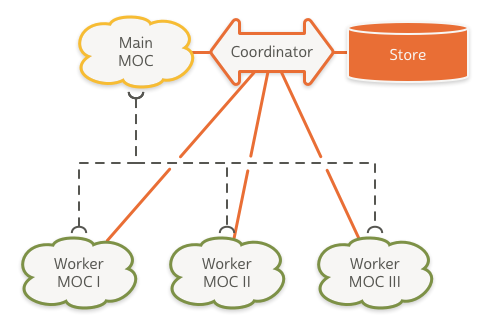

# BNR CoreData Stack
[](https://github.com/Carthage/Carthage)
[](https://img.shields.io/cocoapods/v/BNRCoreDataStack.svg)
[](./LICENSE)

The BNR CoreData Stack is a small framework, written in Swift, that makes it easy to quickly set up a multi-threading ready CoreData stack.

## Requirements

- iOS 8.0+
- Xcode 7.0+
- Swift 2.0+

## Installation

### [Carthage]

[Carthage]: https://github.com/Carthage/Carthage

Add the following to your Cartfile:

```
github "BigNerdRanch/CoreDataStack"
```

Then run `carthage update`.

Follow the current instructions in [Carthage's README][carthage-installation]
for up to date installation instructions.

[carthage-installation]: https://github.com/Carthage/Carthage/blob/master/README.md

### [CocoaPods]

[CocoaPods]: http://cocoapods.org

Add the following to your [Podfile](http://guides.cocoapods.org/using/the-podfile.html):

```ruby
pod 'BNRCoreDataStack'
```

You will also need to make sure you're opting into using frameworks:

```ruby
use_frameworks!
```

Then run `pod install`.


### Nested Managed Object Context Stack Type


### Shared Persistent Store Coordinator Stack Type



### Shared Store Stack Type


### BNR Stack


## Usage

### Constructing Your Stack

#### Import Framework

via: Carthage

```
import CoreDataStack
```

or via CocoaPods

```
import BNRCoreDataStack
```

#### Standard SQLite Backed

```
CoreDataStack.constructSQLiteStack(withModelName: "TestModel") { result in
	switch result {
	case .Success(let stack):
		self.myCoreDataStack = stack
		print("Success")
	case .Failure(let error):
		print(error)
	}
}
```

#### In-Memory Only

```
do {
	myCoreDataStack = try CoreDataStack.constructInMemoryStack(withModelName: "TestModel")
} catch {
	print(error)
}

```

### Working with Managed Object Contexts

#### Private Persisting/Coordinator Connected Context

_wouldn't typically need to do anything with this..._

```
myCoreDataStack.privateQueueContext
```

#### Main Queue / UI Layer Context

_common work?_
_saves here propagate automatically to the persisting..._ 

```
myCoreDataStack.mainQueueContext
``` 

#### Creating a Worker Context

_things you'd do with worker?_
_saves here automatically propagate up_

```
let workerContext = myCoreDataStack.newBackgroundWorkerMOC()
```

#### Large Import Operation Context

_Identify that this is actually your bottle neck first_

_A new Persistent Store Coordinator must be constructed so this is async_

```
myCoreDataStack.newBatchOperationContext() { result in
    switch result {
    case .Success(let batchContext):
        // my big import operation
    case .Failure(let error):
        print(error)
    }
}
```

_New data will be available at the store level when a new fetch is performed but managed object contexts (main queue, worker contexts) will not receive updates or change notifications._

### Resetting The Stack

_can be necessary to start from scratch with your stack.....user logout..._

```
myCoreDataStack?.resetSQLiteStore() { result in
    switch result {
    case .Success:
        // proceed with fresh CoreData Stack
    case .Failure(let error):
        print(error)
    }
}
```

## About

[](http://bignerdranch.com)

- We [Develop][develop] custom apps for clients around the world.
- We [Teach][teach] immersive development bootcamps.
- We [Write][write] best-selling Big Nerd Ranch Guides.

[develop]: https://www.bignerdranch.com/we-develop/
[teach]: https://www.bignerdranch.com/we-teach/
[write]: https://www.bignerdranch.com/we-write/